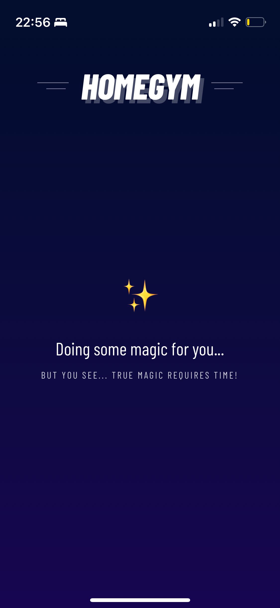
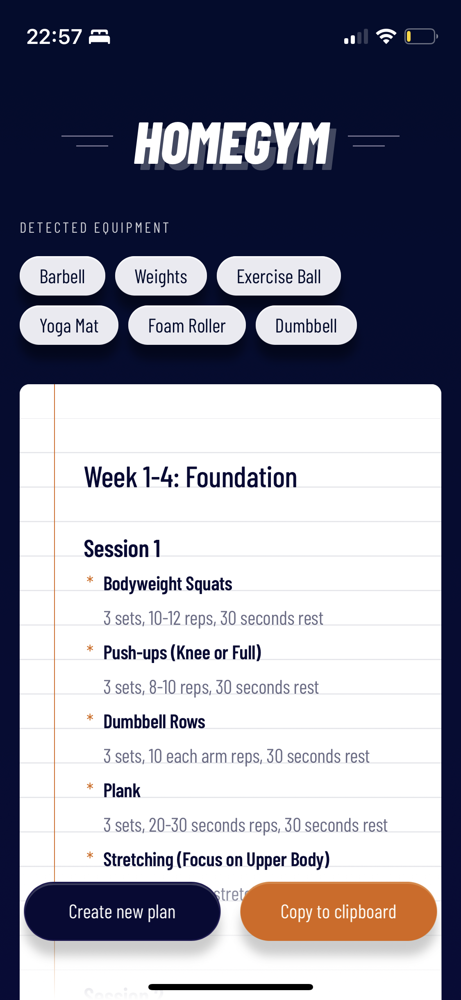

<h1 align="center"><p>🏋 Homegym 🏋</p></h1>

<p align="center">Get workouts based on what's around you, powered by AI magic ✨<br>
<i>Inspired by <a href="https://github.com/Doriandarko" target="_blank">@Doriandarko</a> poem-cam</i></p>

## The problem

Many of us have home gym equipment, but finding workout plans that actually use what we own is surprisingly difficult. Most online plans either leave some equipment gathering dust or push you to buy more gear, cluttering up your garage or living room even more.

## My solution

Create personalized workout plans based on your actual equipment. 

But let's be honest—sometimes we're too lazy to list everything we have. That's where AI comes into play: simply scan your equipment and get a tailored, effective workout plan designed around what you already own.

https://github.com/user-attachments/assets/e4dbe6c5-2a18-4b87-9f4c-658b595d58a9

## Mobile PWA
The app works on mobile as well, giving you the chance to actually take the picture from the app.

<div>



</div>


See it in action [here](https://www.michelemazzucco.it/projects/homegym).

## How to Use

1. Take a photo or upload an image of your home gym equipment
2. Select your preferences (level, sessions per week, and number of weeks)
3. Click "Let's go!" to analyze the image
4. Check the identified equipment and tailored workout plan
5. Copy the plan to your clipboard for later use

## Local setup

Wanna try this app? Here are the steps to have it working on your laptop :)

1. Install dependencies:

```bash
npm install
```

2. Create `.env.local` file:

```bash
cp .env.local.example .env.local
```

3. Add your OpenAI API key to `.env.local`:

```
OPENAI_API_KEY=your_openai_api_key_here
```

4. Run the development server:

```bash
npm run dev
```

5. Open [http://localhost:3000](http://localhost:3000)
