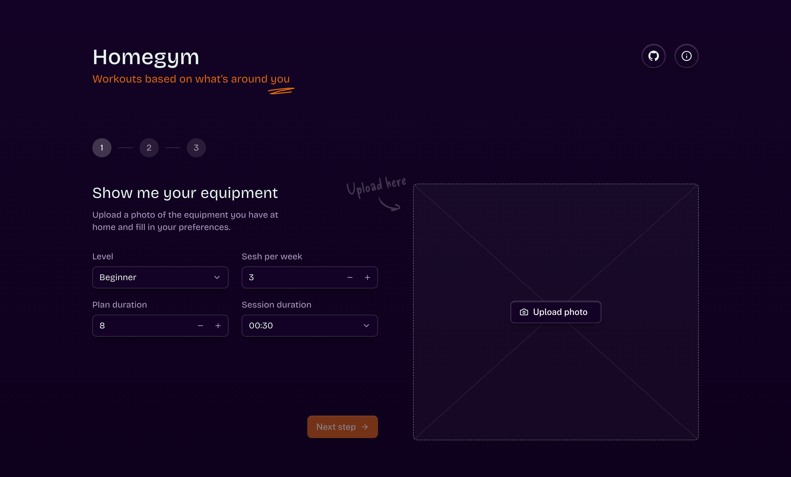

# Homegym 🏋

### Take a photo of your equipment, get a workout plan built around it

_Inspired by <a href="https://github.com/Doriandarko" target="_blank">@Doriandarko</a> poem-cam_



## Why

I have some equipment at home, and the plans I found online either ignored half of it or told me
to buy one more thing. So part of the stuff sits there unused, and I keep doing the same three
exercises.

Writing down everything I own in a form would fix that, and I never did it, because it is boring.
Taking a photo is not. So the app reads the photo, shows me what it found, and writes the plan
around the equipment I confirm.

## The three steps

1. **Set it up.** Level, sessions per week, how long a session lasts, how many weeks the plan
   runs. Then upload a photo of your equipment, or take one if you are on a phone.
2. **Check the gear.** The app lists what it found in the photo. Untick what it got wrong, and add
   what it missed.
3. **Train.** You get a plan built only around the equipment you confirmed. Copy it and get going.

The plan lives in `localStorage`, so a reload brings you back to it.

## Run it locally

```bash
pnpm install
cp .env.local.example .env.local
```

Put your OpenAI key in `.env.local`:

```
OPENAI_API_KEY=your_openai_api_key_here
```

Then `pnpm dev` and open [http://localhost:3000](http://localhost:3000). The deployed version asks
for the key in a dialog instead, and never keeps it.

### No OpenAI credits?

Set `MOCK_OPENAI=true` in `.env.local`. The API routes return canned data and the whole three-step
flow works without a single call to OpenAI. The fake plan still reacts to your level, sessions per
week, plan duration and confirmed equipment, so it is good enough to click through the UI. A "Mock
data" pill shows up next to the step indicator, so you always know what you are looking at.
