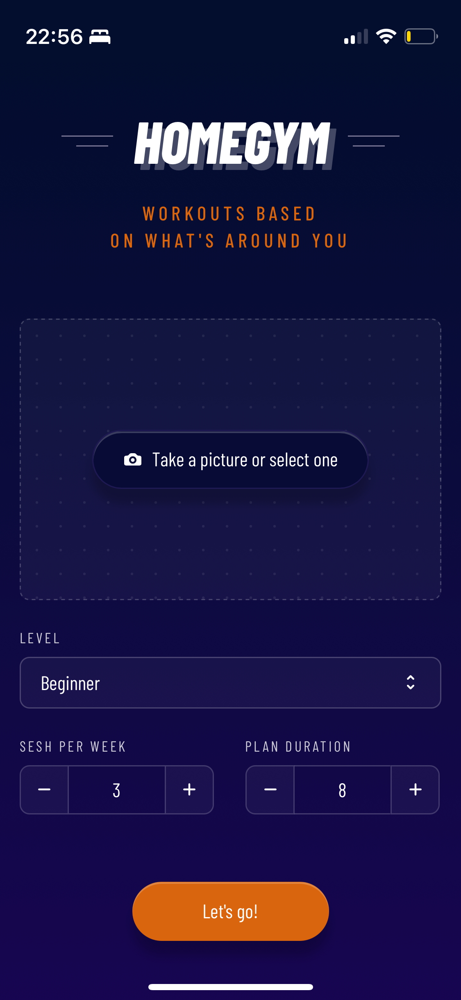
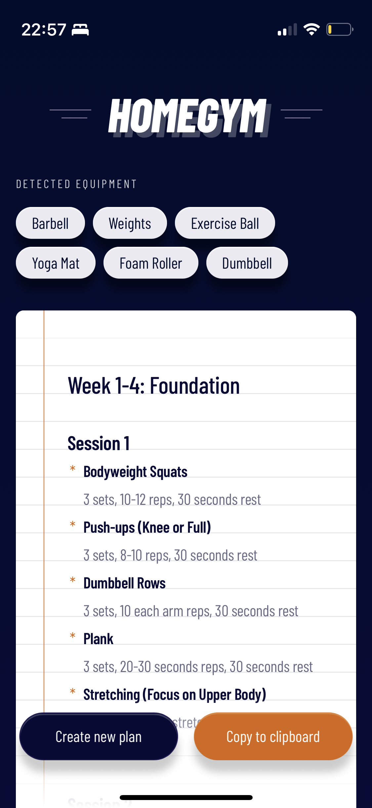

<h1 align="center"><p>🏋 Homegym 🏋</p></h1>

<p align="center">Get workouts based on what's around you, powered by AI magic ✨<br>
<i>Inspired by <a href="https://github.com/Doriandarko" target="_blank">@Doriandarko</a> poem-cam</i></p>

## The problem

Many of us have home gym equipment, but finding workout plans that actually use what we own is surprisingly difficult. Most online plans either leave some equipment gathering dust or push you to buy more gear, cluttering up your garage or living room even more.

## My solution

Create personalized workout plans based on your actual equipment.

But let's be honest—sometimes we're too lazy to list everything we have. That's where AI comes into play: simply scan your equipment and get a tailored, effective workout plan designed around what you already own.

https://github.com/user-attachments/assets/e4dbe6c5-2a18-4b87-9f4c-658b595d58a9

## Mobile PWA

The app works on mobile as well, giving you the chance to actually take the picture from the app.

<div>



</div>

👀 See it in action [here](https://www.michelemazzucco.it/projects/homegym).

## How to Use

The app walks you through three steps:

1. **Set it up.** Pick your level, sessions per week and how many weeks the plan runs, then take a photo or upload an image of your equipment.
2. **Check the gear.** The app lists what it found in the photo. Untick anything it got wrong, remove what does not belong, and add what it missed.
3. **Train.** You get a plan built only around the equipment you confirmed. Copy it or share it.

## Local setup

Wanna try this app? Here are the steps to have it working on your laptop :)

1. Install dependencies:

```bash
pnpm install
```

2. Create `.env.local` file:

```bash
cp .env.local.example .env.local
```

3. Add your OpenAI API key to `.env.local`:

```
OPENAI_API_KEY=your_openai_api_key_here
```

4. Run the development server:

```bash
pnpm dev
```

5. Open [http://localhost:3000](http://localhost:3000)

### No OpenAI credits?

Set `MOCK_OPENAI=true` in `.env.local` and the app runs the full three-step flow on canned data,
without ever calling OpenAI. The plan still reacts to your level, sessions per week, plan duration
and the equipment you confirm, so it is good enough to click through and check the UI. A "Mock
data" pill appears next to the step indicator so you always know what you are looking at.
